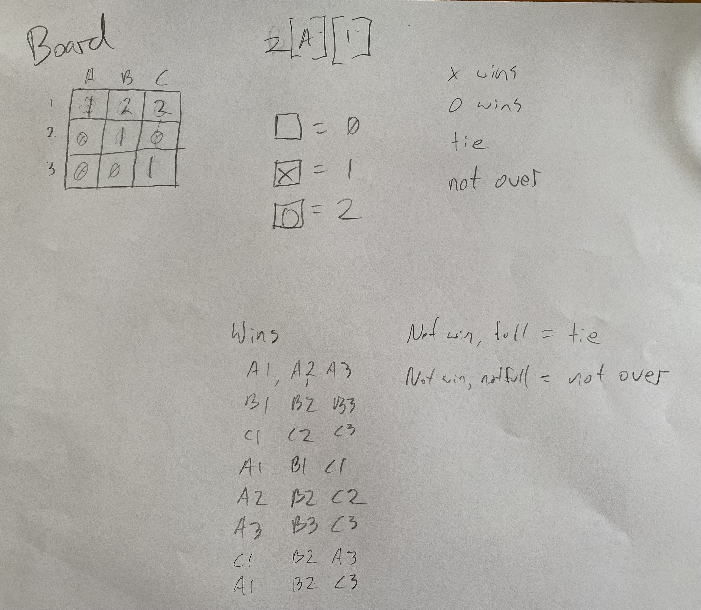

# Journal

## August 1, 2021

"John" (not his real name) wants to learn programming (to make games, of course) and has been working through Tynker lessons. We started with Tynker because he was more comfortable with the Scratch-like point and click interface (he's not yet a strong speller or typist) and, hey, it's a curriculum. I've been programming since I was younger than him but never had strong opinions on how to teach people—certainly I never much followed any of the curricula I was subject to.

I've been reflecting on my own learning experiences, though, and it's hard to overstate the importance of being able to try out ideas, experiment, break things, accidentally make something cool, etc.. In Tynker, at least in the levels he has tried, you can't do any of that. In the name (I imagine) of 'gently' teaching concepts like variables, loops, and conditionals, each exercise is entirely on rails. Few if any control elements that you don't need are even available, and you're doing things like controlling a dragon who can only walk forward or chomp, so there's no way to ignore an exercise's purpose and play.

To make any progress (and have any real fun), we're going to have to do something else.

We started today trying to decide what (simple, 2D) game to build. I drew an example screen of a puzzler idea I had, then talked about the simple games I programmed as a teen (Othello, LEGO-themed Minesweeper, tic-tac-toe). We did a paper prototype of Minesweeper (a pair of hand-drawn 8x8 grids and 10 rolls of 2d8 to place the mines, one person being the computer and the other being the puzzle solver), and he settled on tic-tac-toe for his first game. I am relieved that John, unlike some of his siblings I could mention, is actually willing to start small.

We played a round and then talked about how to represent the board and the possible game states (X wins, O wins, tie, game not over yet). We talked through how you might go about checking a board state for whether anyone won. Some of our notes, here:



For language and framework, I really wanted something simple and accessible for learning, and after a bit of research and consultation with his older siblings, we're trying Lua LÖVE, a friendly and simple 2D game framework. I've never used Lua in earnest, but it's a simple, small language with very JavaScript-like semantics, so I don't feel like I'll have to waste a lot of energy.

Early results are very encouraging. I got LOGO flashbacks from this little triangle-drawing example, and that's a very, very good thing.

```lua
love.draw = function()
  love.graphics.polygon('line', 50, 0, 0, 100, 100, 100)
end
```

In our work today, we've skipped the first chapter of [this tutorial](https://rvagamejams.com/learn2love/) and gone straight into the second, then got sidetracked almost immediately combining the ideas in interesting and surprisingly cool-looking ways. We're just through [2.3](https://rvagamejams.com/learn2love/pages/02-03-geometry.html). As of now, you can see a JavaScript version of what we made just by opening `main.html` in a browser.